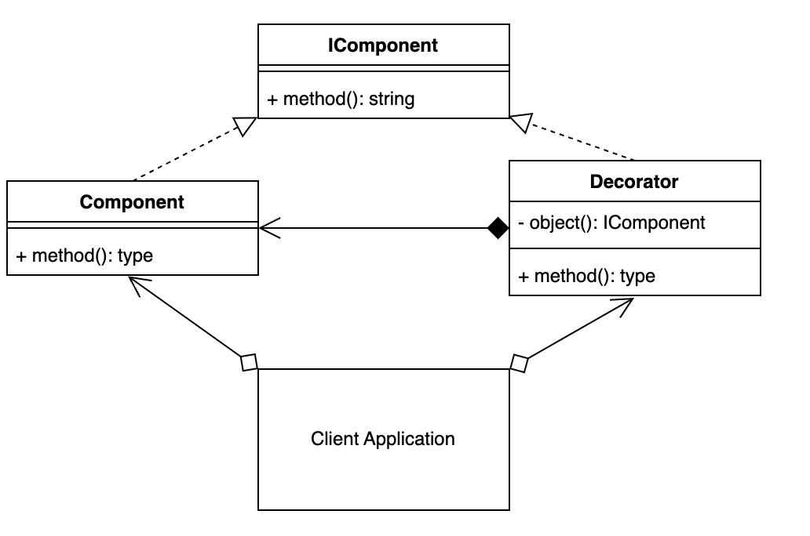
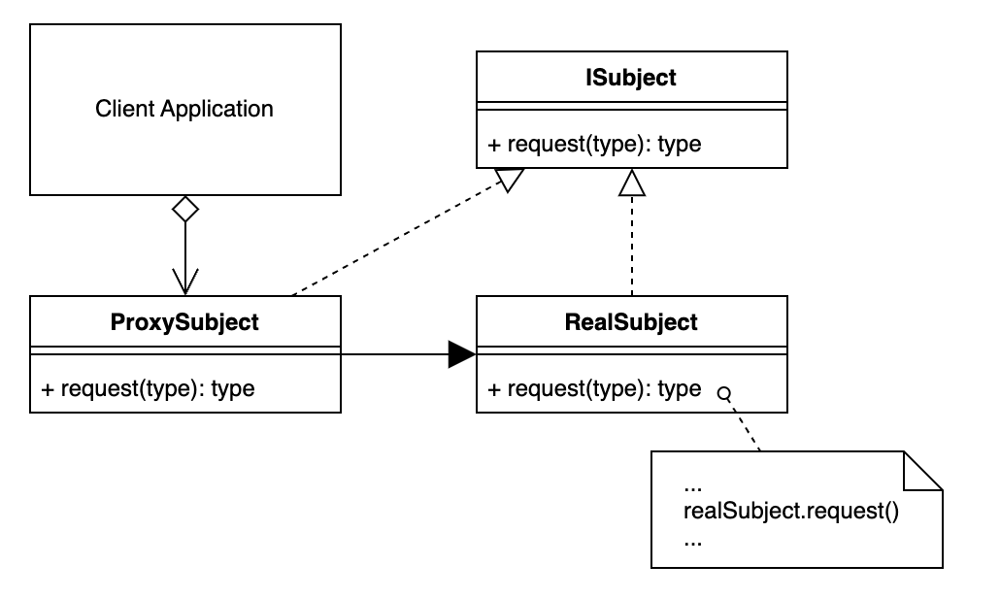

# patterns
develop patterns java

## Порождающие паттерны:

### Abstract Factory
Клиент : Клиентское приложение, которое вызывает Абстрактную Фабрику . Это тот же процесс, что и Конкретный Создатель в шаблоне проектирования Фабрика .

Абстрактная фабрика : общий интерфейс для всех подфабрик.

Конкретная фабрика : подфабрика Абстрактной фабрики , содержащая метод(ы), позволяющий создавать Конкретный продукт .

Абстрактный продукт : Интерфейс и/или абстракция для продукта, который возвращает подфабрика.

Конкретный продукт : объект, который в конечном итоге возвращается.

### Builder
Продукт : Изготавливаемый продукт.

Интерфейс строителя : Интерфейс, который должен реализовать строитель.

Builder : Предоставляет методы для построения и извлечения конкретного продукта. Реализует интерфейс Builder .

Директор : имеет construct() метод, который при вызове создает индивидуальный продукт, используя методы Конструктора .

### Factory Method

### Prototype
Интерфейс прототипа : интерфейс, описывающий метод clone().

Прототип : Объект/Продукт, реализующий интерфейс Прототипа.

Клиент : клиентское приложение, которое использует и создает ProtoType.

### Singleton

## Структурные паттерны:

### Adapter
Цель : доменно-специфический интерфейс или класс, который необходимо адаптировать.

Адаптер : Конкретный класс адаптера, содержащий процесс адаптации.

Интерфейс адаптера : интерфейс, который адаптеру необходимо реализовать, чтобы сделать цель совместимой с клиентом.

Клиент : клиентское приложение, которое будет использовать адаптер.

### Decorator
Интерфейс компонента : интерфейс для объектов.

Компонент : Объект, который может быть украшен.

Decorator : Класс, который применяет дополнительные обязанности к декорируемому компоненту. Он также реализует тот же интерфейс компонента.

### Facade

### Proxy
Proxy : Объект с интерфейсом, идентичным реальному субъекту. Может выступать в качестве заполнителя, пока не будет загружен реальный субъект, или в качестве привратника, применяющего дополнительную функциональность.

Интерфейс субъекта : интерфейс, реализуемый как прокси-сервером, так и реальным субъектом.

Реальный субъект : фактический реальный объект, который представляет прокси.

Клиент : клиентское приложение, которое использует и создает прокси.

### Flyweight
Интерфейс приспособленца : Интерфейс, описывающий внутренние свойства приспособленца.

Конкретный легковес : фактический объект-приспособленец, который хранит внутренние атрибуты и создается при необходимости фабрикой.

Flyweight Factory : Создает и управляет приспособляемыми весами во время выполнения. Он повторно использует приспособляемые весы или создает новый по требованию.

Контекст : Любой объект(ы) в вашем приложении, который будет использовать Flyweight Factory.

Клиент : клиентское приложение, содержащее контексты.

## Поведенческие паттерны:

### Chain of responsibility
Интерфейс обработчика : общий интерфейс для обработки и передачи объектов через каждого преемника.

Конкретный обработчик : класс, действующий как преемник, обрабатывающий запросы и передающий их следующему.

Клиент : приложение или класс, который инициирует вызов первого конкретного обработчика (преемника) в цепочке.

### Iterator
Интерфейс итератора : интерфейс для реализации объекта.

Конкретный итератор : (Итерируемый) экземпляр объекта, реализующий итератор и содержащий коллекцию агрегатов.

Интерфейс агрегата : интерфейс для определения агрегата (объекта).

Конкретный агрегат : объект, реализующий интерфейс агрегата.

### Mediator
Посредник : Координатор коммуникаций между компонентами (коллегами).

Коллеги : Один из многих типов concrete компонентов, в которых используется медиатор.

### Memento
Originator : Originator — это объект с внутренним состоянием, которое время от времени меняется.

Caretaker : (Хранитель) Класс, который просит Originator создать или восстановить Мементы. Caretaker затем сохраняет их в кэше или хранилище мементов.

Память : копия внутреннего состояния Originator, которая впоследствии может быть восстановлена обратно в Originator для замены его текущего состояния.

